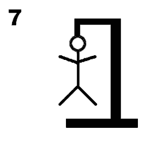

# Galgje

## Te raden woord

|.|.|A|.|
|-|-|-|-|
|1|2|3|4|

## Score

## Beurten
E?
nee het is fout.
I?
nee het is fout.
A?
YES
O?
nope
R?
nee 
D?
Het woord was Play
game over

Gedaan door Daan en João